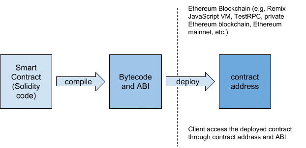

# introduction
solidity 是一個能夠在 ethereum blockchain 產生 smart contract 的程式語言，跟 javascript 在語法上有點相似，但是是 strong typed language


# starting
可先到 http://remix.ethereum.org 這個 online editor 做練習

## example
```bash
pragma solidity ^0.4.17; # 指定現在要寫的 solidity version
# 定義 contract，類似定義一個 class
contract Inbox {
    # declare instance variables，public 代表這個 contract 發佈到 blockchain 上每個人都可使用，使用 public 定義一個 variable 也等於產生一個會回傳自己的 function
    string public message;
    # 與 contract 同名，這是一個 constructor
    function Inbox(string initialMessage) public {
        message = initialMessage;
    }
    # 定義函數，如果是要修改合約的函數就不要 return 任何東西，因為是會扣 ether 的
    function setMessage(string newMessage) public {
        message = newMessage;
    }
    # func name, func type, return types,因前面定義的 string public message;這 func 其實已經沒用了
    # function getMessage() public view returns(string){
    #     return message;
    # }
}
```

## function type
func type | meaning
----------|---------
public    | any one can call this function on network
private   | only this contract can call this function
view      | this func returns data and doesn't modify contract data
constant  | same as view
pure      | func will not modify or even read contract data
payable   | when someone call this func they might send ether along

## external account to create contract trx
field | meaning
------|--------
nonce | how many times the sender has sent a trx
to | -(一般 trx 都要指定給誰，當給空值時代表建立新合約)
data | compiled bytecode of the contract
value | amount of 'Wei' to send to the target address
gasPrice | sender 願意付多少 Wei per gas 來處理這筆 trx
startGas/gasLimit | 這筆 trx 上限是多少 units of gas(例:這筆 trx 有一個加號和乘號總共需要 8 gas，但 gasLimit 只給 6 gas 那這筆 trx 就只會執行到一半，也就是這筆 trx 無法成立!) 
v/r/s | generated from sender's private key and can generate sender address

[gas price ref!](https://docs.google.com/spreadsheets/d/1n6mRqkBz3iWcOlRem_mO09GtSKEKrAsfO7Frgx18pNU/edit#gid=0)

## 'msg' global variable
撰寫 solidity 時，就會存在在全域的變數
property name | property
---------|----------
msg.data|data field
msg.gas|amount of ags
msg.sender|address of sender account
msg.value|amount of ether that was sent with trx 
## basic types
types |
------|
string|
bool  |
int   | integer, positive or negative == int256
int8, int16, ..., int256| ...
uint  | integer,positive == uint256
fixed/ufixed| number with decimal
address| has method for sending money

## reference types
types |
------|
fixed array| unchanging length, single type
dynamic array| single type, can change length
mapping| key value, key has same type,value has same type
struct | collection of key value can have different types

## 示意圖


## file structure
```
package.json
compile.js
deploy.js
contracts
  -Inbox.sol
test
  -test.js
```

## compile
```cmd
yarn add solc
```
```js
'compile.js'
const path = require('path');
const fs = require('fs');
const solc = require('solc');

const inboxPath = path.resolve(__dirname, 'contracts', 'Inbox.sol');
const source = fs.readFileSync(inboxPath, 'utf8');

// bytecode 就是要 deploy 到 blockchain，interface 就是 ABI
module.exports = solc.compile(source, 1).contracts[':Inbox'];
```

## require
```js
// require 也是個 global variable，只要條件不符合該function直接中斷
function enter() public payable {
    require(msg.value > .01 ether);
}
```

## storage vs memory
```js
contract Numbers {
    int[] public numbers;
    
    function Numbers() public {
        numbers.push(20);
        numbers.push(32);
        // 如果用 storage 的話會讓 numbers 和 myArray 指向同一個位置(reference)
        int[] storage myArray = numbers;
        // 用  memory 的話，等於會複製一分到 memory 用完就會刪除，不會指向同一位置
        int[] memory myArray = numbers;
        myArray[0] = 1;
    }
}

```