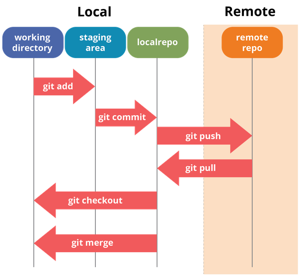

# configuration
git config --global user.name "account"

git config --global user.email "email address"

# generate ssh key,open git bash
ssh-keygen 

複製 public 到 ssh key 驗證(到gitlab 網站右上角 -> setting -> 點選 ssh key)

# create new repository
git clone git@gitlab.com:josh199483/secuX_web_apps.git

> git remote add origin git@gitlab.com:josh199483/secuX_web_apps.git

cd secuX_web_apps

git add README.md

git commit -m "add README"

git push -u origin master

git pull



# create branch
git branch (branch name)

git checkout (branch name)

git checkout -b (branch name)

# git merge
```bash
「O」代表每次 commit, (越下面的 commit 越新)
「*」代表目前所在分支
O master (較舊)
 \
  O 
  |
  O bug/123* (最新)

# Case1 - 合併 master與 bug/123 (合併後, 沒有留下合併的歷史紀錄)
>> git checkout master
>> git merge bug/123
#  O
#   \
#    O 
#    |
#    O bug/123, master*

# Case2 - 合併 master與 bug/123, 使用「--no-ff」 (合併後, 留下歷史紀錄)
>> git checkout master
>> git merge bug/123 --no-ff 
#  O
#  |\
#  | |
#  | O bug/123
#  | |
#  |/
#  O master*

#         O 
#         |\
#         O | 
#         | O bug/123*
#  master O
>> git checkout master
>> git merge bug/123
#         O 
#         |\
#         O | 
#         | O bug/123
#         O |
#         |/
#         O master*
```

# git stash
git checkout develop

touch Tired.java

echo 'print("I am ...");' >> Tired.java

git stash save -u "正在寫 Tired.java, 被抓去修 Hello.java的 bug，傻眼..."

git checkout bug

處理完 bug 之後...

git checkout develop

git stash pop (也可以用取 id 的方式)

# clone 遠端分支
git clone -b develop(branch name) <repository url>

# track remote branch
git branch --set-upstream-to=origin/<branch> master

# check local and remote branch relationship
git branch -vv

# pull remote branch to local
[info](https://blog.csdn.net/carfge/article/details/79691360)