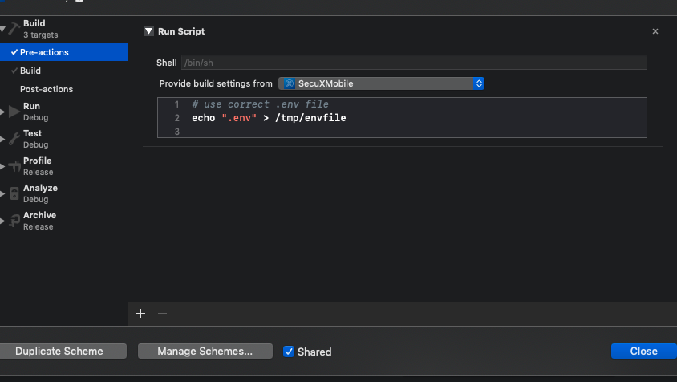

# iOS
因為想要簡化 react native 上架 iOS app store 的整套開發流程

以下是幾個必要的步驟，會自己查document和try and error方式來進行，並記錄中間所遇到的任何問題

想要和 web 開發一樣能夠在不同的 phase 之下有對應的 configuration，例如不同的 URL or API_KEY，所以理想狀況應該是用 npm 執行不同的參數就會吃到對應的 env file，最後再透過 fastlane 讓所有的 iOS android app上架流程一致

要處理兩大部分：
## 1. react native
這邊使用 react-native-config(https://github.com/luggit/react-native-config)
安裝和 link 部分可以去 github 參考

接著建立一個 .env file
```
NODE_ENV=develop
SERVER_URL=http://localhost:8000
```
staging(.env.staging) and production(.env.production) phase 也分別建立一個 file

接著到 xcode
```
Product -> Scheme -> Edit Scheme -> Duplicate Scheme
```
複製兩份各自取名叫 (sample.staging and sample.production)

choose edit scheme and select sample.staging

Build -> Pre-actions -> add new run script action

接著把下圖中的 script 的 .env file 依照你上面所選擇的 scheme 修改成你要的 env file

把 .env .env.staging .env.production 三個都設定好

之後就依照自己的需要選擇不同的 scheme build project



接著預設狀況下，其他新建立的 scheme 沒辦法被 share 出去，也會沒辦法被 CI server 等外部取用，所以要把這兩個 scheme share 出去

```
Product -> scheme -> manage scheme
```

把你剛建立的 sample.staging and sample.production 勾選 shared 就完成囉！


## 2. xcode
首先我這邊是分成三個 phase，debug/release/appstore