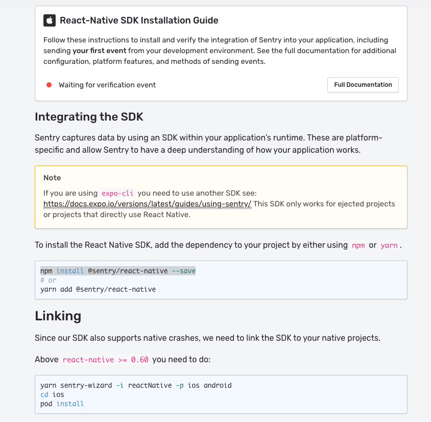

## react native with sentry
首先先照著 document 安裝和 link

等到把 initialize step 貼到自己的 code 之後，試著隨便 throw error 出來

如果成功 catch error,點下圖的 take me to event

這時就可以從 issue 看到自己的 error 被記錄下來

接著來整合 slack

Settings > Integrations

install slack

照著步驟做，可以選擇特定的 channel 被通知
！[specific channel](.sentry/setup_slack_channel.png)