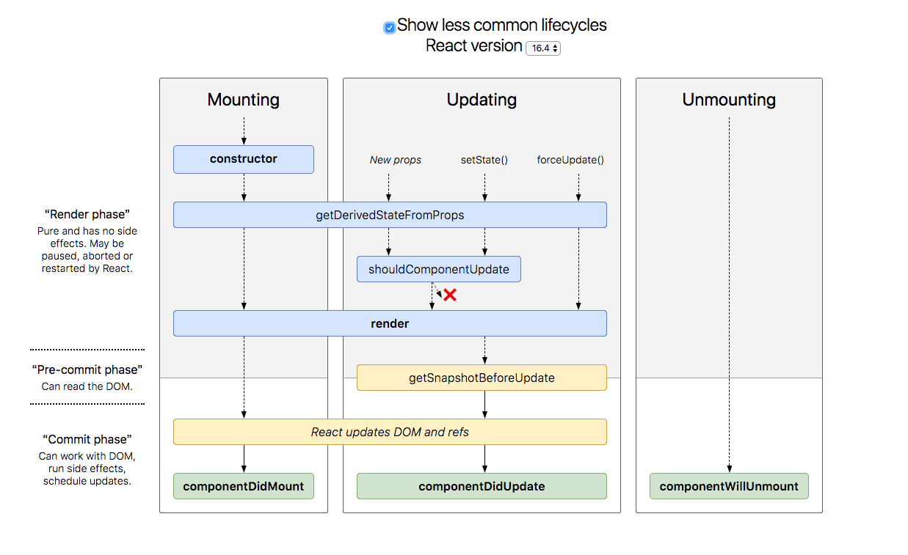

# 安裝
npm init
npm install --save react react-dom

# javascript this 的用法
[ref](https://software.intel.com/zh-cn/blogs/2013/10/09/javascript-this)

# lifecycle


# 初次使用
```js
import React from 'react';
import ReactDOM from 'react-dom';
// 如果只是單純要 render ui 沒有要記錄 state，使用 arrow function 來設計
// Functional Component 讓設計更單純，減少副作用(減少耗費資源)
const MyComponent = () => (
	<div>Hello, World!</div>
);

class App extends React.Component {
  // constructor 可加可不加，但加了一定要用 super() 來繼承父類別的 constructor
  constructor(props) {
    super(props);
    this.state = {
    };
  }
  render() {
    return (
      <div>
        <h1>Hello, World!</h1>
      </div>
    );
  }
}

ReactDOM.render(<App />, document.getElementById('app'));
```

# props 驗證
```js
// 簡化寫法
const HelloMessage = (props) => (
	<div>Hello {props.name}</div>
);
// PropTypes 驗證，若傳入的 props type 不是 string 將會顯示錯誤
HelloMessage.propTypes = {
  name: React.PropTypes.string,
}

// Prop 預設值，若對應 props 沒傳入值將會使用 default 值 john。用法等於 ES5 的 getDefaultProps
HelloMessage.defaultProps = {
 name: 'john',
}

ReactDOM.render(<HelloMessage name="josh" />, document.getElementById('app'));
```

# state 處理狀態
```js
class Timer extends React.Component {
	constructor(props) {
		super(props);
		// 與 ES5 React.createClass({}) 不同的是 component 內自定義的方法需要自行綁定 this 
    // context，否則下面定義的 tick func 會把 this 指向到自己function 本身，但它並不是
    // component 物件，所以並沒有 setState function，因此要綁定 this 到tick func才不會出錯
    this.tick = this.tick.bind(this);
		// 初始 state，等於 ES5 中的 getInitialState
		this.state = {
			secondsElapsed: 0,
		}
	}
	// 累加器方法，每一秒被呼叫後就會使用 setState() 更新內部 state，讓 Component 重新 render
	tick() {
	  this.setState({secondsElapsed: this.state.secondsElapsed + 1});
	}
	// componentDidMount 為 component 生命週期中階段 component 已插入節點的階段，通常一些非同步操作都會放置在這個階段。這便是每1秒鐘會去呼叫 tick 方法
	componentDidMount() {
	  this.interval = setInterval(this.tick, 1000);
	}
	// componentWillUnmount 為 component 生命週期中 component 即將移出插入的節點的階段。這邊移除了 setInterval 效力
	componentWillUnmount() {
		clearInterval(this.interval);
	}
	// render 為 class Component 中唯一需要定義的方法，其回傳 component 欲顯示的內容
	render() {
    return (
      <div>Seconds Elapsed: {this.state.secondsElapsed}</div>
    );
	}
}

ReactDOM.render(<Timer />, document.getElementById('app'));
```

# es7 寫法 
## state
```js
class Todo extends React.Component {
  state = {
    maxLength: this.props.maxLength,
  }
}
```

## proptypes and default props
```js
class Todo extends React.Component {
  static defaultProps = {
    checked: false,
  }; // 注意有分號
  static propTypes = {
    checked: React.PropTypes.bool.isRequired,
  };
  render() {
  	return();
  }
}
```

## arrow function
```js
// 這樣寫就不需要再 constructor 在自己 binding
// 例如:this.handleChange = this.handleChange.bind(this)
class Todo extends React.Component {
  handleChange = (e) => {
      if (e.target instanceof HTMLInputElement) {
        this.setState({
          inputValue: e.target.value,
        })
      }
  }
  render() {
  	return();
  }
}
```

## spread attributes
```js
class Todo extends React.Component {
  render() {
    let {
      className,
      ...others,  // ...others 包含 this.props 除了 className 外所有值。this.props = {value: 'true', title: 'header', className: 'content'}
    } = this.props;
    return (
      <div className={className}>
        <TodoList {...others} />
        <button onClick={this.handleLoadMoreClick}>Load more</button>
      </div>
    );
  }
}
```
