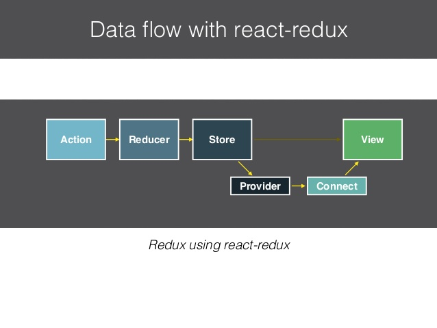

[ref](https://github.com/kdchang/reactjs101/blob/master/Ch07/react-redux-introduction.md)

# 安裝
```bash
npm install --save react react-dom redux react-redux immutable redux-actions redux-immutable

npm install --save-dev babel-core babel-eslint babel-loader babel-preset-es2015 babel-preset-react eslint eslint-config-airbnb eslint-loader eslint-plugin-import eslint-plugin-jsx-a11y eslint-plugin-react html-webpack-plugin webpack webpack-dev-server
```

# data flow


[advanced](https://github.com/chentsulin/redux/tree/new-doc-zh-tw/docs)
